```mermaid
graph TB
    A["📝 <b>User Request</b><br/>username, repo, theme"] --> B["🔧 <b>Vercel API</b><br/>Serverless Function"]
    B --> C["🔍 <b>GitHub GraphQL</b><br/>Repository Data<br/>Stars, Forks, Issues, PRs"]
    B --> D["👥 <b>GitHub REST</b><br/>Contributor Stats<br/>Commits, Authors"]
    C --> E["📊 <b>Data Processor</b><br/>Calculate Metrics<br/>Health, Activity, Rates"]
    D --> E
    E --> F["🎨 <b>Theme Engine</b><br/>Apply Colors & Style<br/>13+ Themes Available"]
    F --> G["🖼️ <b>SVG Generator</b><br/>Create Visual Card<br/>Stats, Charts, Badges"]
    G --> H["✅ <b>Response</b><br/>Beautiful SVG Card<br/>Ready to Embed"]
    
    style A fill:#e3f2fd,stroke:#1976d2,stroke-width:2px
    style B fill:#0969da,stroke:#0550ae,stroke-width:2px,color:#fff
    style C fill:#238636,stroke:#1a7f37,stroke-width:2px,color:#fff
    style D fill:#238636,stroke:#1a7f37,stroke-width:2px,color:#fff
    style E fill:#7c3aed,stroke:#6d28d9,stroke-width:2px,color:#fff
    style F fill:#db2777,stroke:#be185d,stroke-width:2px,color:#fff
    style G fill:#ea580c,stroke:#c2410c,stroke-width:2px,color:#fff
    style H fill:#059669,stroke:#047857,stroke-width:2px,color:#fff
```

<!-- Banner Image -->

[](https://github.com/fewinfos)


# 📦 GitHub Repository Stats Widget

An open-source, fully client-side tool that visualizes **real-time GitHub repository statistics** in an interactive and customizable format — perfect for developers, open-source maintainers, and portfolio builders.

---

<div align="center">

## 🎯 Objective

<table>
<tr>
<td align="center">

**Transform GitHub repositories into stunning visual cards**

This widget uses GitHub's powerful GraphQL API to fetch and display comprehensive repository metrics, activity indicators, language breakdowns, top contributors, and health status in a beautiful, embeddable SVG format that brings your projects to life.

</td>
</tr>
</table>

</div>

---

<div align="center">

## ✨ Features

**Comprehensive repository insights at a glance**

</div>

<div align="center">

<table>
<tr>
<td width="50%" valign="top">

### 📊 Repository Metrics
- ⭐ **Stars** • 🍴 **Forks** • 👁 **Watchers**
- 🔴 **Issues** • 🔀 **Pull Requests**
- 👥 **Contributors** • 📦 **Size**
- 📅 **Created & Updated Dates**

### 💪 Activity & Health
- **Health Status** - Active/Stale indicator
- **Commit Activity** - High/Medium/Low
- **PR Merge Rate** - Success percentage
- **Issue Close Rate** - Resolution metrics

### 🎨 Customization
- **13+ Themes** - Light, Dark, Dracula & more
- **1000px Width** - Full README coverage
- **Auto-Height** - Adapts to content
- **SVG Format** - Crisp on any screen

</td>
<td width="50%" valign="top">

### 💻 Visual Insights
- **Language Breakdown** - Top 5 languages with percentages
- **Contributor Cards** - Top 6 with avatars & commits
- **Topics/Tags** - Repository tags as badges
- **Latest Release** - Version & publish date

### 🚀 Technical Features
- 🔄 **Single GraphQL Query** - Optimized performance
- ⚡ **Serverless Architecture** - Fast & scalable
- 🔒 **Secure** - Token-based authentication
- 🖼️ **Embeddable** - Works anywhere SVG is supported

### 📋 Repository Details
- **License Information** - License type display
- **Default Branch** - Branch indicator
- **Features** - Issues, Wiki, Pages, Discussions
- **Gradient Headers** - Eye-catching design

</td>
</tr>
</table>

</div>

---

<div align="center">

## 🧱 Tech Stack

**Built with modern technologies for optimal performance**

</div>

<div align="center">

<table>
<tr>
<td align="center" width="20%">

<br><strong>Node.js</strong>
<br><sub>Serverless Runtime</sub>
</td>
<td align="center" width="20%">

<br><strong>GitHub API</strong>
<br><sub>GraphQL & REST</sub>
</td>
<td align="center" width="20%">

<br><strong>SVG</strong>
<br><sub>Dynamic Cards</sub>
</td>
<td align="center" width="20%">

<br><strong>Vercel</strong>
<br><sub>Serverless Platform</sub>
</td>
<td align="center" width="20%">

<br><strong>JavaScript</strong>
<br><sub>Core Language</sub>
</td>
</tr>
</table>

</div>

---

<div align="center">

## 🚀 Quick Start

**Get started in seconds!**

### 💡 Basic Usage

```markdown

```

---

### 🎨 Theme Gallery

**Choose from 13+ beautiful themes**

<table>
<tr>
<td align="center" width="33%">

**Light Theme**


`theme=light`

</td>
<td align="center" width="33%">

**Dark Theme**


`theme=dark`

</td>
<td align="center" width="33%">

**Dracula Theme**


`theme=dracula`

</td>
</tr>
<tr>
<td align="center" width="33%">

**Tokyo Night**


`theme=tokyonight`

</td>
<td align="center" width="33%">

**Radical Theme**


`theme=radical`

</td>
<td align="center" width="33%">

**Gruvbox Theme**


`theme=gruvbox`

</td>
</tr>
</table>

**More Themes:** `onedark` • `cobalt` • `synthwave` • `highcontrast` • `discord` • `github_dark` • `merko`

</div>

---

<div align="center">

## 📂 Project Structure

</div>

<div align="center">

<table>
<tr>
<td>

```
readme-activity-calender/
├── api/
│   ├── index.js           # Main serverless API endpoint
│   └── package.json       # API dependencies
├── themes/
│   └── index.js           # Theme configurations
├── public/
│   └── index.html         # Interactive card generator UI
├── docs/                  # Multi-language documentation
├── vercel.json            # Vercel deployment config
├── README.md              # This documentation
├── USAGE.md               # Detailed usage guide
└── LICENSE                # License information
```

</td>
</tr>
</table>

</div>

<div align="center">

## 🏗️ Architecture & Workflow

**Simple, fast, and efficient**


</div>

<div align="center">



</div>

<div align="center">

<table>
<tr>
<td align="center" width="25%">

🚀 **Step 1**

**Request**

API receives parameters

</td>
<td align="center" width="25%">

📋 **Step 2**

**Fetch Data**

Query GitHub APIs

</td>
<td align="center" width="25%">

⚙️ **Step 3**

**Process & Style**

Calculate & theme

</td>
<td align="center" width="25%">

✨ **Step 4**

**Generate SVG**

Return beautiful card

</td>
</tr>
</table>

</div>

---

<div align="center">

## 🚀 Setup & Deployment

**Get your repository stats widget up and running in minutes**

</div>

---

<div align="center">

### 🔑 Prerequisites

**Before deploying, you'll need a GitHub Personal Access Token**

</div>

<div align="center">

<table>
<tr>
<td>

**Step 1:** Visit [GitHub Settings](https://github.com/settings/tokens)

**Step 2:** Navigate to **Developer settings → Personal access tokens → Tokens (classic)**

**Step 3:** Click **Generate new token (classic)**

**Step 4:** Select scopes: `repo` (Full control of private repositories)

**Step 5:** Generate and **copy the token** (you won't see it again!)

</td>
</tr>
</table>

</div>

---

<div align="center">

### 🚀 Deploy to Vercel (Recommended)

[](https://vercel.com/new/clone?repository-url=https://github.com/fewinfos/github-repo-readme-stats)

</div>

<div align="center">

<table>
<tr>
<td>

**Quick Deploy Steps:**

```bash
# 1. Click "Deploy with Vercel" button above
# 2. Sign in with GitHub
# 3. Add environment variable:
#    Name: GITHUB_TOKEN
#    Value: <your_github_token>
# 4. Click Deploy!
```

✅ Your API will be live at: `https://your-project-name.vercel.app/api`

</td>
</tr>
</table>

</div>

---

<div align="center">

### ⚙️ Environment Variables

**Required configuration for deployment**

</div>

<div align="center">

<table>
<tr>
<td>

| Variable | Type | Description |
|:---------|:----:|:------------|
| `GITHUB_TOKEN` | **Required** | GitHub Personal Access Token with `repo` scope for API authentication |

> **⚠️ Important:** Never commit your `.env` file or expose your token publicly!

</td>
</tr>
</table>

</div>

---

<div align="center">

## 📚 Documentation & Resources

**Everything you need to get started and contribute**

</div>

<div align="center">

<table>
<tr>
<td width="50%" valign="top">

### 📖 Main Documentation

- 📝 **[Usage Guide](USAGE.md)** - Comprehensive API usage instructions
- 🔧 **[Contributing Guide](CONTRIBUTING.md)** - How to contribute to the project
- 🛡️ **[Security Policy](SECURITY.md)** - Security guidelines and reporting
- 📜 **[Code of Conduct](CODE_OF_CONDUCT.md)** - Community guidelines
- ⚖️ **[License](LICENSE)** - MIT License details

</td>
<td width="50%" valign="top">

### 🌍 Multi-Language Docs

- 🇩🇪 [Deutsch (German)](docs/readme_de.md)
- 🇪🇸 [Español (Spanish)](docs/readme_es.md)  
- 🇫🇷 [Français (French)](docs/readme_fr.md)
- 🇮🇳 [हिंदी (Hindi)](docs/readme_hi.md)
- 🇯🇵 [日本語 (Japanese)](docs/readme_jp.md)
- 🇰🇷 [한국어 (Korean)](docs/readme_ko.md)
- 🇷🇺 [Русский (Russian)](docs/readme_ru.md)
- 🇨🇳 [中文 (Chinese)](docs/readme_zh.md)

</td>
</tr>
</table>

</div>

---

<div align="center">

## 🤝 Contributing

**We love contributions!** 💖

**Join our amazing community of contributors**

</div>

<div align="center">

<table>
<tr>
<td>

### How to Contribute

1. 🍴 **Fork** the repository
2. 🌱 **Create** a feature branch (`git checkout -b feature/AmazingFeature`)
3. ✨ **Commit** your changes (`git commit -m 'Add some AmazingFeature'`)
4. 🚀 **Push** to the branch (`git push origin feature/AmazingFeature`)
5. 📩 **Open** a Pull Request

### Ways to Contribute

- 🐛 Report bugs and issues
- 💡 Suggest new features or enhancements  
- 📝 Improve documentation
- 🎨 Add new themes
- 🌍 Translate to other languages
- ⭐ Star the repository

**Please read our [Contributing Guide](CONTRIBUTING.md) for detailed guidelines.**

</td>
</tr>
</table>

</div>

---

<div align="center">

## 📜 License

**Open Source • Free Forever**

</div>

<div align="center">

<table>
<tr>
<td align="center">

This project is licensed under the **MIT License**

See [LICENSE](LICENSE) file for details

```
Permissions: ✓ Commercial use ✓ Modification ✓ Distribution ✓ Private use
Limitations: ✗ Liability ✗ Warranty
```

</td>
</tr>
</table>

</div>

---

<div align="center">

## 🙏 Acknowledgments

**Powered by amazing technologies and supported by the community**

</div>

<div align="center">

<table>
<tr>
<td align="center" width="33%">

### 💙 GitHub
**GraphQL & REST API**

For providing comprehensive repository data access

</td>
<td align="center" width="33%">

### ▲ Vercel  
**Serverless Platform**

For reliable and fast hosting infrastructure

</td>
<td align="center" width="33%">

### 👥 Community
**Contributors & Users**

For continuous support and improvements

</td>
</tr>
</table>

</div>

---

<div align="center">

## 🌟 Contributors

**Thank you to all the amazing people who have contributed to this project!** 💖

**Hall of Fame** ⭐

</div>

<div align="center">

<a href="https://github.com/fewinfos/github-repo-readme-stats/graphs/contributors">
  
</a>

_Made with [contrib.rocks](https://contrib.rocks)_

</div>

---

<div align="center">

## ⭐ Show Your Support

**Love this project? Give it a star!** ⭐

</div>

<div align="center">

<table>
<tr>
<td align="center">

[](https://github.com/fewinfos/github-repo-readme-stats)

### 📈 Star History

[](https://star-history.com/#fewinfos/github-repo-readme-stats&Date)

</td>
</tr>
</table>

</div>

---

<div align="center">

**Made with ❤️ by the community**

[Report Bug](https://github.com/fewinfos/github-repo-readme-stats/issues) · [Request Feature](https://github.com/fewinfos/github-repo-readme-stats/issues) · [Documentation](USAGE.md)

</div>

